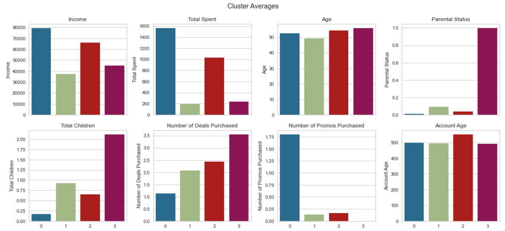
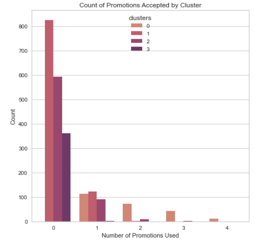
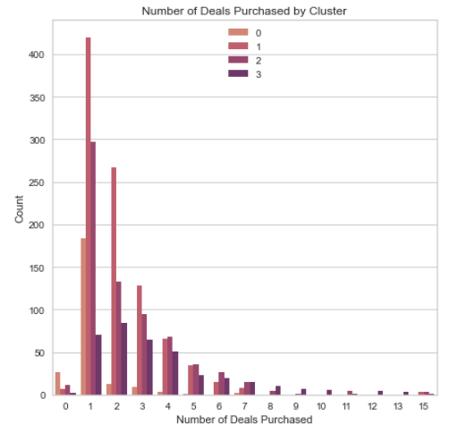

# Customer Segmentation and Sales Predictions

### Problem Statement
---

In order to drive successful targetted promotions and advertisements, can we segment our customer base into similar groups?  Additionally, using the traits and data on hand, can we use linear regression to predict a user's spending within a few thousand dollars?

### Executive Summary 
---

Statistics and machine learning algorithms are some of the most powerful and interesting tools in tech right now, and their applications are seemingly endless.  The amount of customer data companies have at their fingertips in the year 2021 is staggering but then the question is, how do we use this data to help drive growth and revenue?  One helpful way to do this is customer segmentation, dividing the customer base into smaller groups with similar traits in order to evaluate trends, habits, and broader characteristics.  In this project I seek to find the ideal clustering and then evaluate models to see if we can predict how much a customer will spend based on their demographic information.

**1. Sample Details:**
- Data from Kaggle
- 2240 unique user profiles
- 29 features

**2. Sources:**
- https://www.kaggle.com

**3. Data Dictionary:**

|Feature   | Dtype  | Description  |
|---|---|---|
| ID  | int  | User ID  |
| Year_Birth  | int  | User's birth year  |
| Education  | string  | User's level of education  |
| Marital_Status  | string  | User's relationship status   |
| Income  | float  | User's income  |
| Kidhome  | int  | # of non-teenage children in a user's household  |
| Teenhome  | int  | # of teenage children in the user's household  |
| Dt_Customer  | string  | Date the the user joined the website  |
| Recency  | int  | # of days since the user's last purchase  |
| MntWines | int  | Amount spent on wine in the last 2 years  |
| MntFruits  | int  | Amount spent on wine in the last 2 years   |
| MntMeatProducts  | int  | Amount spent on meat in the last 2 years   |
| MntFishProducts  | int  | Amount spent on fish in the last 2 years  |
| MntSweetProduct  | int  | Amount spent on sweets in the last 2 years  |
| MntGoldProds  | int  | Amount spent on gold in the last 2 years  |
| NumDealsPurchases  | int  | # of purchases made with a discount  |
| NumWebPurchases  | int  | # of purchases made through the website  |
| NumCatalogPurchases | int | # of purchases made through the catalogue  |
| NumStorePurchases  | int  | # of purchases made in stores |
| NumWebVisitsMonth  | int  | # of web visits in the last month  |
| AcceptedCmp1  | int  | Bool, 1 if customer accepted the offer in the 1st campaign  |
| AcceptedCmp2  | int  | Bool, 1 if customer accepted the offer in the 2nd campaign   |
| AcceptedCmp3  | int  | Bool, 1 if customer accepted the offer in the 3rd campaign   |
| AcceptedCmp4  | int  | Bool, 1 if customer accepted the offer in the 4th campaign   |
| AcceptedCmp5  | int  | Bool, 1 if customer accepted the offer in the 5th campaign  |
| Complain  | int  | Bool, 1 if the customer has filed a complaint in the last year   |

### Conclusion & Inferences
---

A few quick visualizations to help understand conlusions and inferences:

#### We can see the largest cluster is by far group #1:

    

#### For reference, since averages don't tell the whole story, below are the box plots of important features:

#### To get a quick snap shot of our cluster info we can compare averages via bar chart:

#### Promos and deals are huge revenue generators and attract new customers as well as incentivize returning customers to come back, often boosting sales by getting folks back in the store or browsing again.  

As you can see, promos were not heavily utilized by customers.  We either need to refine our targetted ads or reevaluate our promos as a whole.

On the other hand, our deals drew in many more users and were much more successful.

### Detailed Cluster Insights and Conclusions/Inferences
---

**Cluster 0:**

1. 238 users, 10.63% of total users, smallest group
2. Highest average income
3. Average spent per user ~$1,562.26
4. Second highest revenue generating group at \$371,181, or 27.4% of total revenue
5. Widest range of ages
6. Few to no children
7. Low interest in deals - about 1 utilized on average
8. High interest in promos - about 2 utilized on average

**C0 Inferences:**
1. Wealthy
2. High spending
3. Diverse ages
4. Childless
5. Attracted to promos
6. Second highest revenue generators
7. High priority group

**Cluster 1:**

1. 947 users, 42.3% of total users, largest group
2. Lowest average income
3. Average spent per user ~$197.96, lowest per user spending of all groups - low spending per user counter-acted by large group size
4. Second lowest revenue generating group at \$187,473 or 13.82% total revenue 
5. Youngest group
6. Most households have about 1 child on average
7. Low interested in deals - about 2 utilized on average
8. Low interest in promos - less than 1 utilized on average

**C1 Inferences:**
1. Low income
2. Low spending
3. Young
4. Likely new parents
5. Some interest in deals
6. Low priority group unless we can attract them with deals or special targetted products

**Cluster 2:**

1. 693 users, 30.95% of total users, third largest group
2. Second highest average income
3. Average spent per user ~\$1,028.26, second highest per user spending of all groups
4. Highest revenue generating group at \$712,587 or 52.51% of total revnue
5. Tighter spread of ages between 44 - 63
6. Most households have 1 or no children
7. Medium interest in deals - about 2.5 utilized on average
8. Low interest in promos - less than 1 utilized on average

**C2 Inferences:**
1. Wealthy
2. High spending
3. Older
4. Middle aged parents
5. Attracted to deals
6. High priority group to draw in with deals
7. Highest revenue drivers by far

**Cluster 3:**

1. 361 users, 16.12% of total users, second smallest group
2. Second lowest average income
3. Average spent per user ~$235.59, second lowest per user spending of all groups
4. Lowest revenue generating group at \$85,048 or 6.27% of total revnue
5. Oldest group on average
6. Most households have at least 2 children
7. Highest interest in deals - about 3.5 utilized on average
8. Almost no utilization of promos

**C3 Inferences:**
1. Medium income
2. Low spending
3. Older folks
4. Almost all families with multiple children
5. Low priority group, low per capita spending as well as low overall revenue.  